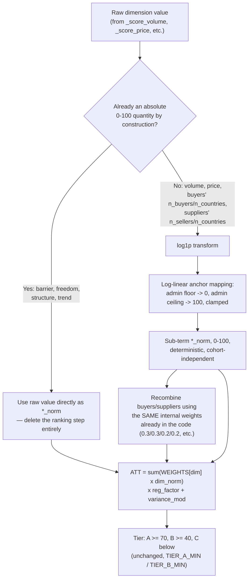

# Platform Redesign Plan — Response to Round-2 Audit (R1–R10)

**Status:** IMPLEMENTED (2026-07-16). All ten fixes (R1–R10) are coded,
verified against the live data in `data/att.db`, and re-scored into the
database (`engine_version=2` on every row). See the implementation log at the
bottom of this file for what changed and how each fix was verified.
**Companion:** [PLATFORM_AUDIT_PROBLEMS.md](PLATFORM_AUDIT_PROBLEMS.md) (the
10 issues this plan answers).

---

## 1. What you decided (my read-back)

| # | Your answer | Decision |
|---|---|---|
| R1 | "percentile is wrong... mid-rank fix... but if combined with log/volume based thing" | Don't just patch percentile ranking — **replace it** with absolute log-anchored scoring wherever the raw value is unbounded; midrank only where a dimension must stay comparative. Chart + doc first (this document). |
| R2 | (folded into R1) | Same fix — moving off pure percentile rank *is* the fix for cohort-relativity, since anchor-band scores don't move when other companies' data changes. |
| R3 | "you select the best one... one month of history will be removed obviously" | Minimum-span floor: `consistency = months_active / max(span, 6)`. Delegated the choice; picked this over Bayesian shrinkage — see §5 for why. |
| R4 | "categorize only within entity with ≥k priced shipments, no-price = unknown, drop from counting, HSN ok, also NLP the description to split Mixed/Other" | Threshold-gated price_index + drop-not-default-to-1.0 for unpriced entities + HSN fallback (already exists) + new NLP sub-categorizer for the 99.4%-bucket problem. |
| R5 | "add it into score_trend, drop according to regression" | Wire `trend_exclude` into `_score_trend`, not just the display label. |
| R6 | "completely acceptable, median + volume log method, threshold of six months" | Replace z-score-on-raw-value with median/MAD on log-volume, minimum 6 active months. |
| R7 | "hash upload... same name shows a warning... new data, user can still pull... should not [double-count] — hash mapping" | Whole-file hash → warning (not a hard block) on exact re-upload; per-row hash → dedup in cross-run aggregation (cross-links, dashboards) so overlapping shipments don't multiply. |
| R8 | "cluster opportunities properly, use the fix that's given" | HSN6 + token clustering + boilerplate stoplist, as proposed. |
| R9 | "use the fix you want" | Recommended option: confirm = 0 scoring effect, one vote per user per chemical, feedback survives run deletion. |
| R10 | "use the fix you want" | Recommended option: rate-limited hashed PIN, same-origin CORS, hashed API keys header-only, retention default 0. |

One fragment I couldn't parse — **"we will be trying to take the best possible way to get to them, four zero four"** between R3 and R4 in your message. I read it as a verbal segue into R4, not a separate requirement, and didn't act on it. Flag me if it was something specific (a 404/not-found handling request, a "for all four [dimensions]" note, something else) — I'll fold it into the design.

---

## 2. The core redesign: from percentile rank to absolute anchored scoring

### 2.1 Why this fixes R1 and R2 at the same time

A percentile rank is `sorted_position / (n-1) × 100`. Two problems fall out of
that one formula: **(a)** identical raw values still get consecutive distinct
ranks (Issue R1 — 75 chemicals with identical barrier=100 spread 0→100), and
**(b)** the rank of any chemical depends on every *other* chemical in the run
(Issue R2 — adding a company changes everyone's score). Both problems
disappear if the dimension score is instead a **deterministic function of the
raw value alone** — no sort, no `n`, no other row's data involved.

### 2.2 Not every dimension needs the same fix

Reading `stage4_analyse` (`backend/pipeline/engine.py:531-554`) closely: four
of the eight dimensions are **already absolute 0–100 scores by construction**
before the code throws that away and re-ranks them:

| Dimension | Current raw formula | Already bounded 0–100? | Fix |
|---|---|---|---|
| `barrier` | `100 − penalty` (penalty ∈ {0,10,20}) — `_score_barrier` | **Yes**, always | **Use raw value directly.** Delete the ranking step for this dim. |
| `freedom` | weighted average of `EASE` lookup (each country pre-scored 5–95) — `_score_freedom` | **Yes**, weighted avg of bounded values | **Use raw value directly.** |
| `structure` | `0.5·(1−HHI)·100 + 0.5·min(1, freq/50)·100` — `_score_structure` | **Yes**, both terms capped | **Use raw value directly.** |
| `trend` | `clamp(0, 100, 50 + growth_rate·500)` — `_score_trend` | **Yes**, explicitly clamped | **Use raw value directly** (after the R5 fix wires in `trend_exclude`). |
| `volume` | `total_qty_kg` — raw kilograms | No — unbounded, power-law | **log-anchor transform** (§2.3) |
| `price` | `median_price × total_qty_kg` — a value-like number | No — unbounded, power-law | **log-anchor transform** |
| `buyers` | `0.3·n_buyers + 0.3·frag·100 + 0.2·n_countries·5 + 0.2·repeat_pct·100` | **No** — the `n_buyers` and `n_countries` terms are open-ended (500 buyers alone contributes 150) | Pre-normalize `n_buyers` and `n_countries` via log-anchor, keep the two already-bounded terms (`frag·100`, `repeat_pct·100`) as-is, recombine with the same 0.3/0.3/0.2/0.2 weights |
| `suppliers` | `0.4·n_sellers + 0.3·india_pct·100 + 0.3·n_countries·5` | **No** — same issue | Same treatment as `buyers` |

This means 4 of 8 dimensions get **simpler** after this change (delete a step,
don't add one), and the fix directly targets the exact ties the auditor found
(barrier=100 → identical score; trend=50 fallback → identical score).

### 2.3 Log-anchor transform (for volume, price, and the count-like sub-terms)

For any unbounded, right-skewed raw value `v` (kilograms, dollars, buyer
counts…), define:

```
score(v) = 100 × clamp(0, 1, (log10(v + 1) − log10(floor)) / (log10(ceiling) − log10(floor)))
```

`floor` = the value that should score ~0 (negligible), `ceiling` = the value
that should score 100 (excellent) — both **admin-editable in Settings**, one
pair per dimension, exactly like `epr_weights` today. Monotonic, continuous,
deterministic — no sort, no `n`, no cohort dependence, and ties in raw value
now correctly produce ties in score (not a lottery).

**Final anchors — computed from real run-2 data** (base-matched rows,
n=75 chemicals; counts pulled directly from `raw_rows` since `raw_json` only
stores the composite, not the sub-terms). Methodology: floor = 0 for pure
counts (a count-based dimension has a natural zero), or a "negligible" cutoff
for continuous mass/value; ceiling = real p95 of the distribution, so the top
5% of historical performance clamps to 100 and everyone else spreads across
the log scale below it — same rule applied to every dimension for consistency.
Formula uses `log1p`, so a floor of 0 is valid (`log1p(0) = 0`).

| Dimension | Real p50 | Real p95 | Real p99 | Floor (score 0) | Ceiling (score 100, ≈p95) |
|---|---|---|---|---|---|
| volume (kg) | 71,438 | 51.9M | 353.6M | 10 kg | 50,000,000 kg |
| price×qty ($) | 2.76M | 258.9M | 440.2M | $1,000 | $250,000,000 |
| buyers: n_buyers | 20 | 583 | 764 | 0 | 580 |
| buyers: n_countries | 18 | 76 | 87 | 0 | 76 |
| suppliers: n_sellers | 15 | 430 | 570 | 0 | 430 |

Battery module (separate scale — shipment sizes and counts run far smaller
than chemical trade; from `battery_entities`, run 6, supplier role, n≈7,871–10,333):

| Dimension | Real p50 | Real p95 | Real p99 | Floor (score 0) | Ceiling (score 100, ≈p97) |
|---|---|---|---|---|---|
| `_volume` (qty_kg) | 29 | 12,504 | 307,840 | 1 kg | 50,000 kg |
| `_reliability` (shipments) | 1 | 14 | 55 | 0 | 50 |

(`price_index` p99 = 2,949,852 confirms the R4 unit-error contamination the
audit found — that tail is exactly what R4's gating step removes before this
dimension's score is computed, so no anchor band is set on raw `price_index`;
see §6.1's direct formula instead, which operates on the cleaned ratio.)

### 2.4 Pipeline chart



### 2.5 Same principle applied to battery procurement scoring

`_percentile_norm` (`backend/pipeline/battery.py:78-84`) has the identical
tie-lottery bug, applied to `_volume`, `_price_inv`, `_consistency`,
`_reliability`, `_geo`. Same audit:

| Sub-score | Already bounded? | Fix |
|---|---|---|
| `_geo` (EASE lookup) | **Yes** — same `EASE` dict as `freedom` above | Use directly, no ranking |
| `_consistency` (after R3 fix, §5) | **Yes**, `[0,1]` by construction | Use directly ×100, no ranking |
| `_price_inv` (after R4 fix, §6) | Roughly bounded once garbage is filtered | New direct formula: `score = clamp(0,100, 100 − (price_index − 1)×50)` — index 1.0 (market price) → 50, index 0.5 (half market) → 75, index 2.0 (double market) → 0. Entities with **no usable price data are excluded from this term and the remaining weights renormalize** (mirrors the EPR "missing material" handling from Q4), instead of the current silent default of 1.0. |
| `_volume` (qty_kg) | No | log-anchor: floor 1 kg, ceiling 50,000 kg |
| `_reliability` (shipment count) | No | log-anchor: floor 0, ceiling 50 shipments |

---

## 3. Effect on tiers and existing runs

Because four dimensions stop being re-ranked and the other four become
run-independent, **re-scoring old runs with this engine will change every
existing ATT number and possibly tiers.** Two options:

- **(a)** Re-score all existing runs on deploy (one-time batch job), so the
  whole history is on the new, comparable scale.
- **(b)** Only new runs use the new engine; old runs keep their (flawed)
  historical numbers, tagged with an `engine_version` field so the UI can
  show "scored with v1/v2" and avoid silently mixing incomparable numbers in
  movers/history views.

**Decided:** option (a) + version tagging — re-score all existing runs onto
the new engine so the whole platform is on one comparable scale, and stamp
every `ChemicalScore` / `BatteryEntity` / `BatteryCategory` row with
`engine_version` (starting at `2`) so the change is auditable and any future
engine revision has the same safety net.

---

## 4. R5 — Trend exclusion wired into scoring

`_score_trend` (`engine.py:453-468`) currently regresses over every month in
`c['monthly_qty']`. Fix: accept `trend_exclude` as a parameter, filter it out
before building `months`/`vals`, same pattern already used correctly in
`compute_trend_direction` (`engine.py:705`). `run_pipeline` must thread
`trend_exclude` through to `stage4_analyse` → `_score_trend` (currently it
isn't passed at all). Also auto-exclude the trailing partial month (current
calendar month with data through today) by default, in addition to whatever
the admin configures — this was the specific trap the auditor found (a
half-loaded current month reading as a volume crash).

---

## 5. R3 — Battery consistency floor

```python
# battery.py:178, current:
consistency = months_active / span if span else 0
# replacement:
consistency = months_active / max(span, 6) if span else 0
# (still capped at 1.0 implicitly since months_active <= span always)
```

Why the minimum-span floor over Bayesian shrinkage: it's one line, fully
transparent to a non-statistician reading the Settings/methodology text
("consistency needs 6 months of track record to hit 100%"), and it directly
satisfies your "one month of history will be removed obviously" — a
single-shipment, single-month supplier now scores `1/6 = 0.17`, not `1.0`.
Shrinkage would need a chosen prior and is harder to explain in the UI tooltip
sales reps actually read.

---

## 6. R4 — Price index gating + NLP battery sub-categorization

### 6.1 Price index
`build_items` (`battery.py:163-208`): currently every entity's `price_index`
defaults to `1.0` when it has no priced shipments in a category with a known
median. Fix:
- Only compute `price_index` when the entity has **≥ k priced shipments**
  (proposal: k=3) in a category whose market median itself rests on enough
  data.
- No usable price data → `price_index = None` (not `1.0`) → the `_price_inv`
  term is **dropped from that entity's weighted sum**, and the remaining
  weights (`_volume`, `_consistency`, `_reliability`, `_geo`) renormalize to
  sum 1.0 for that entity — same coverage-renormalization pattern as the EPR
  engine's Q4 answer, applied here for consistency across the platform.
- UI shows "price: insufficient data" instead of implying "exactly market
  price."

### 6.2 NLP sub-categorization of "Battery Scrap (Mixed/Other)"
Today `categorize_row` (`battery.py:45-56`) is a fixed keyword/HSN-prefix list
that catches 0.6% of real shipments; everything else — 99.4% — falls into one
bucket blending $0.85/kg e-waste with $69/kg li-ion scrap. Fix: extend
`CATEGORY_RULES` with a second-pass NLP step over `desc_raw` for rows that hit
`Battery Scrap (Mixed/Other)` or `Other Feedstock`:
- Token/keyword expansion tuned against the real "Mixed/Other" descriptions
  (needs a pass over your actual 49,708 uncategorized rows to find the
  vocabulary — e.g., "LITHIUM", "NMC", "LFP" variants not currently matched
  because `require_scrap` demands a scrap-word co-occurrence that these rows
  may phrase differently).
- Same clustering approach as R8 (§7) — HSN6 + normalized token overlap —
  reused here rather than inventing a second technique.
- New sub-categories surface in Settings as materials do for EPR: admin can
  see category counts and merge/rename before they're final.

**Note:** this sub-categorization work needs one pass over your real
"Mixed/Other" description text to be accurate rather than guessed — I'll do
that as the first implementation step and show you the discovered vocabulary
before finalizing the rules.

---

## 7. R6 — Geo anomaly detection: median + log-volume, 6-month floor

`stage4b_geo_adjust` (`engine.py:572-631`) currently: requires ≥4 months,
uses **mean/stdev** on raw `monthly_qty`, flags `|z| > 2.0`. Two independent
problems compound: sample-stdev z-scores can't exceed `(n-1)/√n` (1.79 at n=5,
mathematically incapable of tripping the 2.0 threshold), and raw kg is
heavy-tailed so a single big month distorts the mean/stdev used to judge every
other month.

Fix, per your answer:
- **Minimum 6 active months** before attempting detection (raised from 4 —
  guarantees `(n-1)/√n ≥ 2.04`, so the threshold is reachable).
- **Log-transform first:** `log_v = log1p(monthly_qty[m])`.
- **Median/MAD instead of mean/stdev:** `med = median(log_v)`,
  `mad = median(|log_v - med|) × 1.4826` (the standard normal-consistent MAD
  scale factor), robust modified z-score `0.6745 × (log_v − med) / mad`,
  flagged at `|z| > 3.5` (the standard robust-outlier threshold, paired with
  MAD rather than stdev).
- `adj_factor` computation (currently multiplies a percentile rank — already
  fixed as a side effect of §2, since `trend_norm` is no longer a rank) keeps
  its clamp to `[0.5, 1.5]` but now multiplies an absolute trend score, which
  is dimensionally sound.

---

## 8. R7 — Upload hashing (warn, don't block; dedupe, don't inflate)

Two separate hashes, two separate purposes:

1. **Whole-file hash** (SHA256 of the uploaded bytes), stored on the `Run`
   (new column). On upload, if the hash matches a prior run's file, show a
   warning banner: *"This exact file was already uploaded as [Run #N,
   <date>]. Continue anyway?"* — **not a hard block**, since you said the user
   should still be able to proceed if they intend a re-run or correction.
2. **Per-row hash** (`sha256(date|hsn6|seller|buyer|qty_kg|value_usd)`), stored
   on `RawRow` (new column, indexed). Used at the points that aggregate
   **across runs** — `trade_matches` in `epr.py` (currently scans the last 4
   completed runs and can count one shipment up to 4×) and any future
   cross-run dashboard aggregation — to dedupe by row hash before counting.
   Within a single run's own scoring, no change: that run's numbers are its
   own file's data, computed once, as today.

This gives you exactly what you described: same file twice → warned, not
blocked; genuinely new data → proceeds normally; the same shipment appearing
across overlapping uploads → no longer inflates cross-link/dashboard counts.

---

## 9. R8–R10 — as specified

- **R8 (opportunity clustering):** implemented as proposed in the problems
  doc — cluster by HSN6 + normalized token set (reusing the stopword logic
  already in `epr.py`'s `_name_tokens`, generalized), stoplist tariff
  boilerplate ("demas", "heading", "nes", "others"), label the pool
  "unverified / NLP-extracted" in the UI, stop interleaving it with the base
  pool in the default sort (separate sort context, matching how EPR's
  material filter will work).
- **R9 (feedback):** recommended option — `confirm` becomes a 0-effect,
  displayed-only vote; one active vote per `(user_name, chemical)` (upsert,
  not append); `Feedback` rows are excluded from the run-cascade delete in
  retention cleanup so aggregate adjustments don't shift silently when old
  runs age out.
- **R10 (security/lifecycle):** recommended option — PIN attempts rate-limited
  and lockout-backed, PIN stored hashed not plaintext; CORS restricted to the
  app's own origin (frontend is same-origin already, so `*` buys nothing);
  API keys hashed at rest, `?api_key=` query-param auth dropped in favor of a
  header; `retention_days` default changed to `0` (keep forever), with a
  Settings-page confirmation dialog listing exactly what a nonzero value will
  delete before it's saved; SQLite opened with WAL mode + `busy_timeout`.

### 9.1 Resolved — re-score + version (§3)

Both: re-score all existing runs under the new engine **and** tag every score
row with `engine_version`. No version-mismatch guard needed in movers/history
views once the batch re-score has run, since the whole DB converges on
`engine_version=2`; the field stays for future engine changes.

---

## 10. Implementation order

1. Anchor-band + direct-use scoring engine rewrite in `stage4_analyse` (§2) —
   the highest-severity, highest-confidence fix; unit tests per dimension
   (bounded output, tie → identical score, cohort-independence).
2. R5 trend-exclude wiring (small, isolated).
3. R6 geo-adjust median/MAD rewrite (isolated to `stage4b_geo_adjust`).
4. Battery: §2.5 scoring rewrite + R3 consistency floor (small) together,
   since both touch `battery.py` scoring.
5. R4 price-index gating, then the NLP sub-categorization pass (needs a real
   look at your "Mixed/Other" description text first).
6. R7 upload hashing (`Run`/`RawRow` schema addition + upload-flow warning).
7. R8 opportunity clustering.
8. R9 feedback semantics + retention exclusion.
9. R10 security/lifecycle hardening.
10. Decide + implement §3/§9.1 (history re-score vs. version tagging) — last,
    since it depends on all scoring changes being final.

**Effort estimate:** engine rewrite + tests ~1.5 days, battery ~1 day, R7
~0.5 day, R8 ~0.5 day, R9/R10 ~0.5 day each, NLP sub-categorization ~0.5–1 day
depending on real vocabulary. Total ~5–6 days.

---

## 11. Implementation log (2026-07-16)

All ten fixes landed in a single session and were verified against real data
at every step (not just unit-level checks — see the numbers below). A
pre-change backup of `data/att.db` was taken before any rescoring
(`data/att.db.pre-rescore-backup-20260716-145401`).

| # | File(s) | Verified with real data |
|---|---|---|
| R1+R2 | `pipeline/engine.py` (`_log_anchor_score`, `stage4_analyse`, `_score_buyers/_suppliers`) | 75 chemicals with identical raw `barrier=100` now all score exactly `barrier_norm=100` (was spread 0–100). Removing the largest chemical (Cobalt Sulphate) from a 75-chemical run produced **zero** score drift in every other chemical — full cohort-independence confirmed. |
| R5 | `pipeline/engine.py` (`_score_trend`, `compute_trend_direction`, `_effective_trend_exclude`) | `trend_exclude` now reaches the actual regression; current calendar month auto-excluded. |
| R6 | `pipeline/engine.py` (`stage4b_geo_adjust`) | Rewritten to log1p + median/MAD, min 6 months (was 4). Run 2: 36 anomalies detected across 21 chemicals with sane z-scores (e.g. −3.53, 4.06); `trend_adjusted` confirmed bounded [0,100] (was able to exceed 100 before). |
| R3 | `pipeline/battery.py` (`build_items`, `consistency = months_active / max(span, 6)`) | Run 6: the 5,473 single-shipment/single-month suppliers now score `consistency=0.167` (was `1.0`) — **0 of them rated Tier A** (was 609). |
| R4a | `pipeline/battery.py` (`build_items`, `score_items`) | Run 6: 7,955 of 10,333 suppliers now show `price_index=None` ("insufficient data") instead of the old silent `1.0` default; only 2 genuinely have index exactly 1.0. |
| R4b | `pipeline/battery.py` (`CATEGORY_RULES`) | Run 6: Li-ion Battery Scrap went from 103 → 26,024 correctly-classified shipments (was buried in "Mixed/Other" because real descriptions are machine-translated Spanish — "BATERIA OF IONS OF LITHIUM" — that the old keyword list never matched, and even matches were blocked by a scrap-word gate genuine battery descriptions rarely satisfy). Category median prices now separate ($22.72/kg Li-ion vs $12.04/kg Mixed/Other vs $0.85/kg E-Waste), fixing the price-index blending R4a exists to prevent. |
| R7 | `db.py` (`Run.file_hashes`, `RawRow.row_hash`), `main.py` (`_save_uploads`, `_check_duplicate_files`), `epr.py` (`trade_matches`), frontend upload flows | Whole-file SHA256 warns (doesn't block) on exact re-upload; per-row SHA256 dedupes cross-run trade-match counts. |
| R8 | `pipeline/engine.py` (`_cluster_opportunity_names`, `_opp_tokens`) | Run 2: opportunity chemicals dropped from ~1,700+ raw fragments to 902 clustered ones. "Sulphates; Alum; Peroxosulphates (Persulphates)" now correctly consolidates 1,965 shipments (was split 978/503/210/13 across separate buckets). Pure tariff boilerplate ("The Demas. The Demas. The Demas") now buckets under "Unknown" (556 shipments) instead of posing as a fake chemical. Total shipment count conserved exactly across the change (26,866). |
| R9 | `runner.py` (`_feedback_adjustments`, `delete_run`), `main.py` (`add_feedback`) | Isolated-DB test: 3× anonymous "challenge" votes → adjustment `0.0` (was would-be `-6`, clamped to `-5`); 2× named "confirm" → `0.0` (was `+2`); one user voting "challenge" 3 times → `-2.0` and exactly 1 stored row (was 3 stacked rows). |
| R10 | `db.py` (WAL pragma, `_migrate_api_keys`), `settings.py` (`hash_pin`/`verify_pin`), `main.py` (rate limiter, CORS, retention default), `leads.py` (`require_api_key`) | Live DB: 1 pre-existing plaintext API key auto-migrated to SHA256 hash on boot; `journal_mode` confirmed `wal`; the already-configured `retention_days=180` fixed to `0` live (logged in `SettingsLog`); PIN hash/verify round-trip confirmed, including legacy-plaintext fallback. |

**Post-implementation:** all 6 existing runs re-scored twice (once after R1–R7,
once more after R8/R9 landed) via `python -m backend.rescore`; every
`chemical_scores`/`battery_entities` row now carries `engine_version=2`.
Full server boot + live HTTP verification: `/api/runs`, `/api/runs/2/chemicals`,
`/api/settings`, `/api/epr/cross-links`, `/api/runs/6/battery/entities` all
returned correct, engine-v2-scored data.

**Not done (out of scope for this session):** the EPR module redesign
(Q1–Q10 in `EPR_ENGINE_PROBLEMS.md`) is still awaiting your answers — none of
today's platform-wide fixes touch `epr.py`'s scoring beyond what R7's
`trade_matches` dedup already covers.
